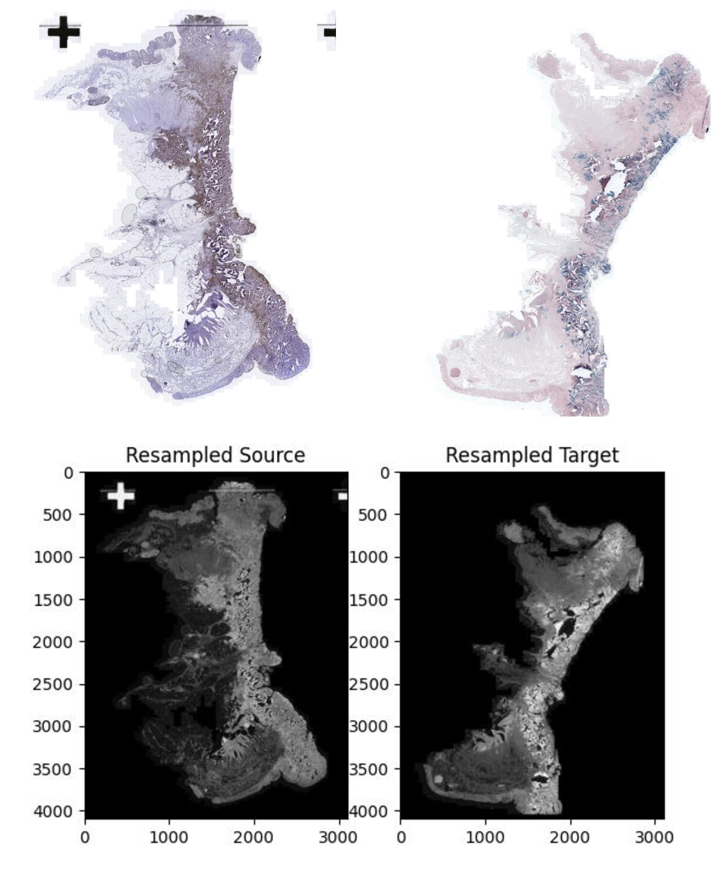

# Implementation of an Unsupervised Deep Learning Registration Framework for Histology Samples with Varied Staining

This is the project for our course 'Progetto di Ingegneria Informatica', A.A. 2023/2024, in collaboration with NecstLab, Politecnico di Milano.

**Academic Tutor:** Prof. Marco Domenico Santambrogio  
**Supervisors:** Isabella Poles, Eleonora D'Arnese

**Contributors:**
- Mattia Cestari
- Valentina Pucci (Progetto di Ingegneria Informatica, 5 CFU)
- Lorenzo Sciarretta (Progetto di Ingegneria Informatica, 5 CFU)

## Dataset
The dataset was provided by the [Anhir Grand Challenge](https://anhir.grand-challenge.org/Data/). This dataset comprises 481 image pairs, divided into 251 evaluation pairs and 230 training pairs, covering eight tissue types: mammary glands, colon adenocarcinomas (COADs), gastric mucosa and adenocarcinomas, breast tissue, mouse kidney, human kidney, lung lesions, and lung lobes.

Images were resampled to about 25% of their original resolution, ranging from 6,000 to 17,000 pixels in one dimension, and are available in .jpg and .png formats. They were converted to .mha format and then to grayscale for preprocessing.

Annotations were provided by nine annotators, with an average of 86 landmarks per image, achieving human-level accuracy. Only the source image landmarks are publicly available for the evaluation set, so part of the training pairs were used for evaluation purposes:
- 200 training pairs from both the original training and evaluation images
- 26 test pairs from the original training dataset
- 26 validation pairs from the original training dataset

The dataset size was reduced to 252 images to speed up the training process.

## Code
In the `CODE` folder, there are files for loading the data (`dataloaders`) and performing the preprocessing (`prepare_preprocessing`), as well as files for initial alignment, affine registration, and non-rigid registration.

We performed our own training in Google Colab. You can find the entire process, from preprocessing to affine registration, at the following link:

1. 

For the non-rigid registration, we used a GPU in a second Google Colab notebook, which you can find here:

2. 

In conclusion, you will find all the final results in the first Colab notebook.

## Acknowledgments
Our code is mainly based on the [DeepHistReg](https://github.com/MWod/DeepHistReg) software by Marek Wodzinski and Henning Müller.
